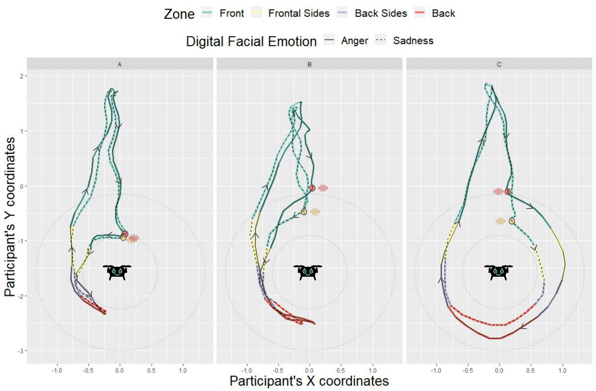
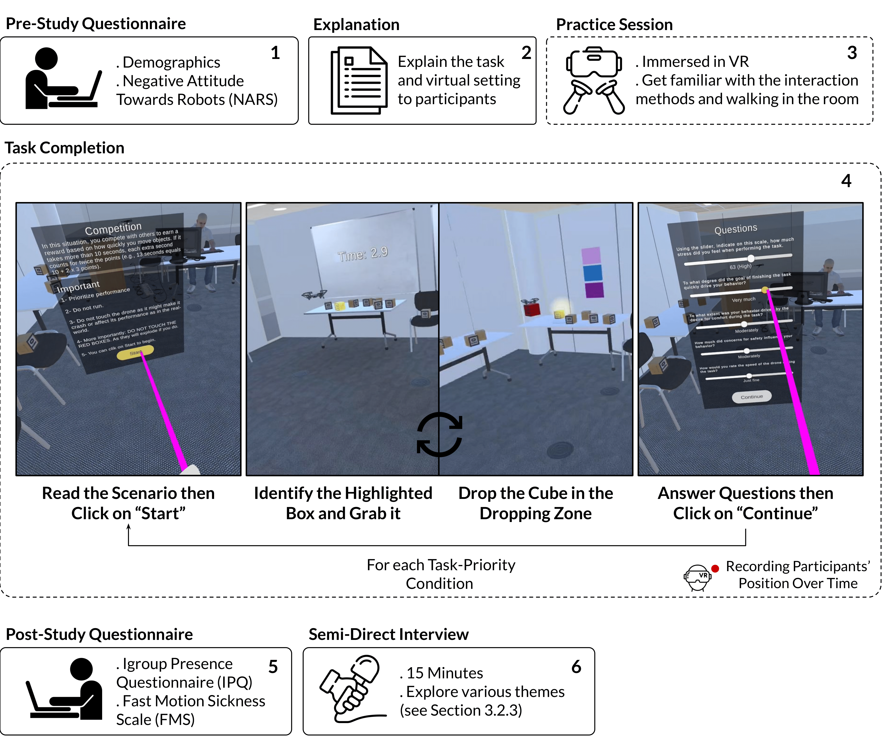
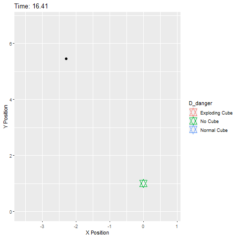
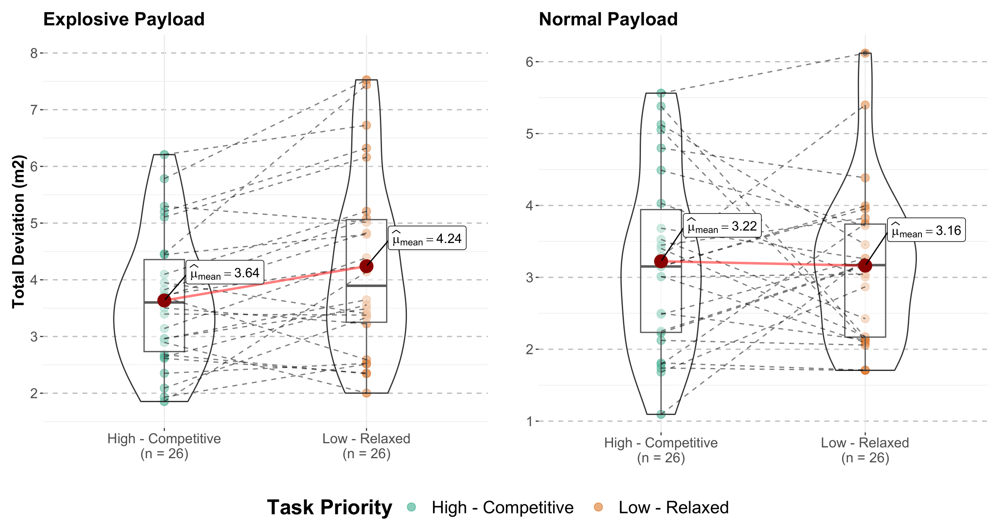
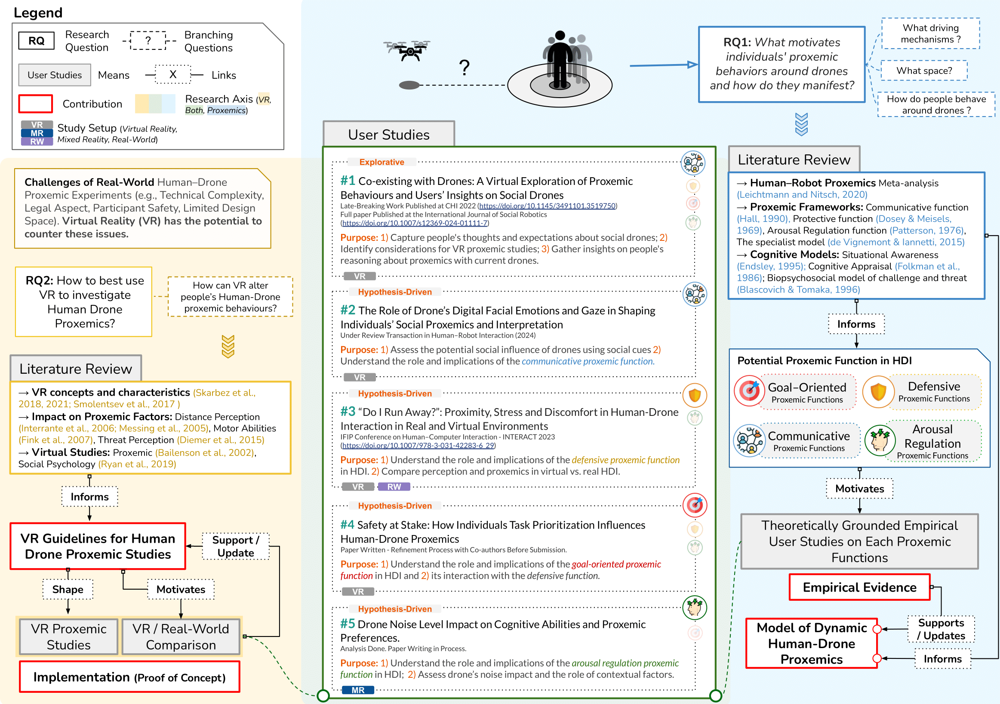
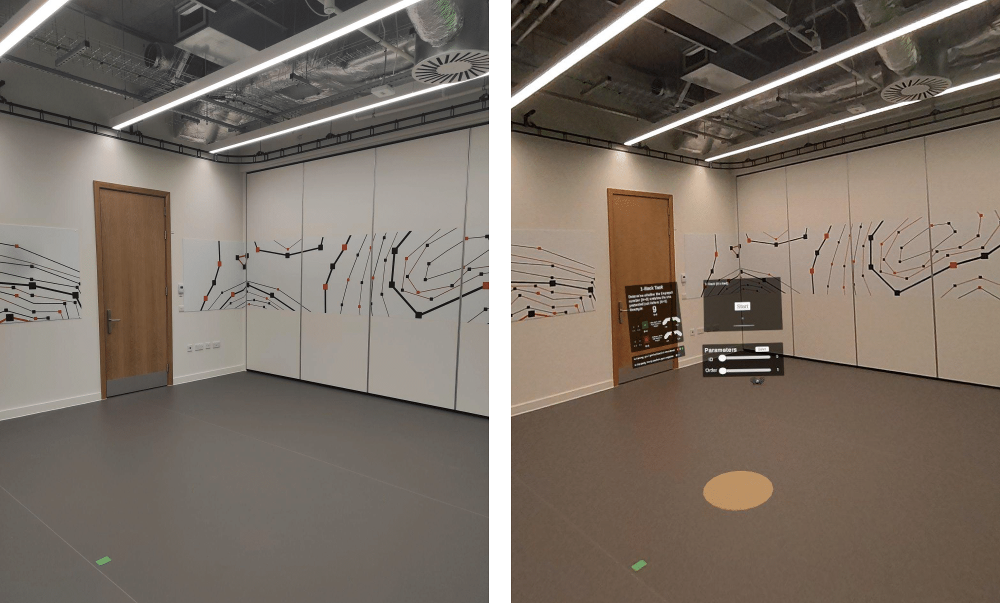
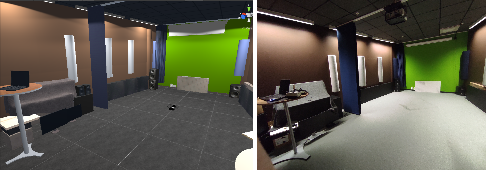
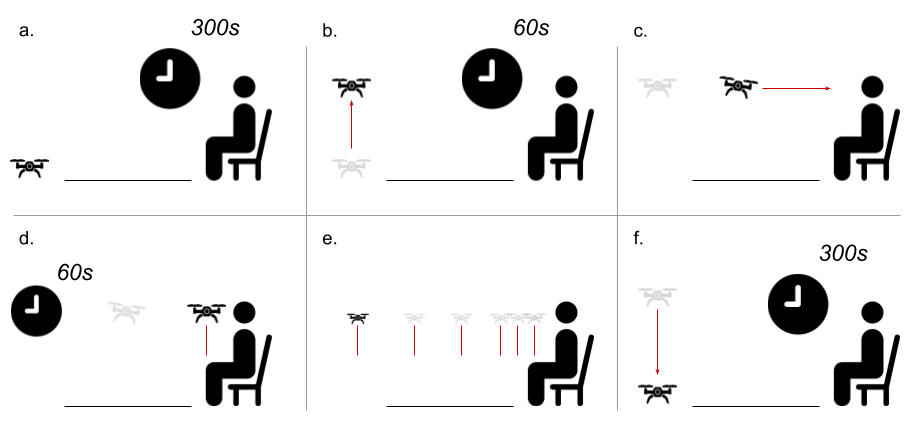
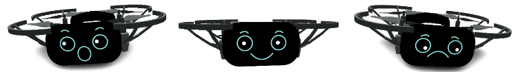
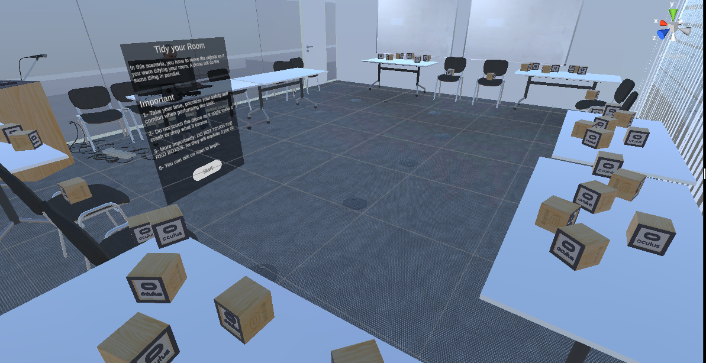

<link href="https://cdn.jsdelivr.net/npm/bootstrap@5.3.0/dist/css/bootstrap.min.css" rel="stylesheet">

    

        <!-- Navigation Links -->
        <ul class="nav nav-pills">
            <li class="nav-item"><a href="index.html" class="nav-link active" aria-current="page">About</a></li>
            <li class="nav-item"><a href="research.html" class="nav-link" aria-current="page">Research</a></li>
            <li class="nav-item"><a href="publication.html" class="nav-link">Publications</a></li>
            <li class="nav-item"><a href="contact.html" class="nav-link">Contact</a></li>
        </ul>
    

    <!-- Content Area (right side) -->
    

        <h1>About Me</h1>

        

            
📌<strong>Current Status:</strong> <em>last updated 01/12/2024</em>

            
Thesis submitted, preparing my Viva for early December 2024. Starting a Post Doctoral position at Télécom Paris in February 2025. Open to collaborations, feel free to contact me!

        

        
I’m a curious researcher with a passion for learning and exploring. In my research, I focuses on how people use space around autonomous drones and explored the use of XR (Extended Reality) as a tool in this field. Recognizing the lack of a theoretical foundation, I developed a model informed by existing proxemic theories, supported by empirical findings collected through user studies. Alongside this, I created guidelines and shared resources to help researchers effectively employ XR in human-drone proxemic studies.

        
        
The knowledge and skills I gained throughout my work have also allowed me to collaborate on a variety of exciting projects, from child safety in social VR and authentication techniques for ATMs to enhancing social robot interactions.

        
        
Beyond research, my interests are all over the place, keeping me inspired and thinking. These include playing music, reading, woodcarving, programming, video games, films, sports, and learning new languages. Since the time I've written this, I’ve probably engaged in a new personal project.

    

    <!-- Profile Box -->
    

        
        <h2>Robin BRETIN</h2>
        
        

            <strong>Keywords:</strong> Human–Drone Interaction, Proxemics, Mixed Reality Application to Research
        

        
        

        
            

                
                
<strong>Post Doctoral Researcher </strong> at Télécom Paris

                
(from February 2025)

                
 XR for Crisis Managment 

            

            

                
                
<strong>PhD Student</strong> (Psychology/Computing Science) at University of Glasgow

                
Graduate in December 2024

            

            
            

                
                
<strong>Cognitive Engineer</strong> (since 2020)

            

            
        

    

    

<!-- Separator Line -->
  

## Research Gallery
Explore a collection of illustrations, graphics, and images from my various projects.

  

    <!-- First item: Image --> 
    

      
      

        
Top view of a participant's path as they walk from the starting point (A) around the virtual drone to reach the colored papers (B,C,D) in the room. The sequence of colors to reach appears on the paper (white square) located on the table (blue rectangle) next to the initial position. The circular boundaries around the drone correspond to Hall's framework's intimate and personal spheres, respectively. We notice that the participant follow similar paths but maintain different distances between the conditions.

      

    

    

      
      

        
Visualization of participants' trajectories tracked through the VR headset during the task. We've chosen three distinct profiles to emphasize the variability in proxemic sensitivity to the drone's expressions. For clarity, we present paths only for the Follow gaze behaviors, comparing Anger and Sadness expressions. The points where participants paused to initiate conversation are marked by speech logos and circles (red for Anger, orange for Sadness). We can observe that participant A exhibits highly consistent proxemic behavior unaffected by the drone's expressions. In contrast, Participant B exhibits variability primarily within the front zone, maintaining a greater distance when initiating conversation with Anger compared to Sadness. Notably, this difference tends to diminish afterward, possibly illustrating a phenomenon elaborated in the discussion section. This phenomenon suggests that participants may shift their perception of the drone from a social entity to a mere obstacle due to the nature of the assigned task (from engaging in conversation to reaching a point behind it).  Lastly, Participant C exhibits a pronounced influence of the digital facial emotions, remaining visibly important in the front (blue path) and frontal side (yellow path) zones, and diminishing upon return to the starting point. This participant also follows a distinct path to accomplish the task.

      

    

    

      
      

        <h5>Third Slide Title</h5>
        
Diagram of participants' Protocol. The process begins after participants have been welcomed and have signed the consent form. Dotted lines indicate steps occurring in the virtual environment, while solid lines represent actions in the real world. (1) Participants provided demographic information and completed the NARS on the experimenter's computer after signing the consent form. (2) Participants received task instructions and specifics of the virtual environment. The experimenter clarified instructions, answered questions, and showed a video demonstration of an explosive box. (3) Participants were immersed in the virtual environment and underwent a practice session without the drone. They performed the experimental task in a simplified environment, allowing them to grab and drop boxes, navigate, and interact with the virtual screen. (4) Participants proceeded with the experimental task by initiating it after reviewing scenario details and clicking "Start". Upon activation, the drone commenced its task, mirroring that of the participants. Participants were tasked with locating and grabbing the highlighted cube, then depositing it within the designated zone. This process repeated for subsequent cubes while avoiding the drone, which occasionally carried explosive boxes. After moving multiple cubes, the drone ceased flying, and the virtual screen reappeared, marking the scenario's end. Participants then answered questions before advancing to the next scenario by clicking "Continue" or removing the headset after completing both scenarios. (5) Participants proceeded to answer the IPQ and FMS on the experimenter's computer. (6) The study concluded with a short semi-directed interview.

      

    

    

      
      

        
Animated GIF illustrating participants navigation around a moving flying drone.

      

    

    

      
      

        
A-- After taking a moment to familiarize themselves with the virtual environment, participants stand on the green spot—both the starting point and the interaction zone with virtual screens in the study. B-- From this starting position, participants approach the drone, featuring a combination of Face and Gaze conditions (illustrated here as Sadness and Follow). They initiate communication with a "Hey," signaling their intent. The drone's light turns green, prompting participants to ask for the next letter with "Can you tell me the next letter?" The drone verbally communicates the letter "B," which participants use in the subsequent steps. C--  Participants navigate around the drone to access the screen on its back. D-- On the screen, participants identify the shape corresponding to the letter provided by the drone. In this specific example, the letter "B" corresponds to the correct shape, which is represented by the yellow square as the next element in the shape sequence. E-- Returning to their initial position, participants input the correct shape in the shape sequence. Incorrect inputs can be removed by clicking on them, while correct inputs prompt questions on the left screen. F--Participants, using the controllers, then answer questions, including a Self-Assessment Questionnaire and Likert scales. The study cycle, starting from step A, continues until participants successfully complete the shape sequence, with the sequence's length aligned with the number of distinct sets of conditions.

      

    

    

      
      

        
Discomfort level (left) and stop-distance ratings (right) in the real (top) and virtual (bottom) environments for each stop condition. Friedman tests revealed a statistically significant effect of the drone stop distance on participants' discomfort and distance rating in both environments. We can observe an increase in discomfort when entering the personal space (below 120 cm). Overall, the personal space frontier (120cm) was rated the closest to participants' ideal distance (rating of 0) in the real (Md=-3.570) and virtual environment (Md=-10).

      

    

    

      
      

        
Boxplot and violin plots illustrating participants' subjective arousal and maintained distance for the three drone sound level conditions in both task condition. Both significantly increased from the low to high sound level condition in a similar trend.

      

    

    

      
      

        
Boxplot and violin plots representing participants Total Deviation from the shortest path for each Task Priority and Drone's Danger conditions.

      

    

    

      
      

        
Dynamic progression of this thesis, mapping the journey from initial research questions to the development of the main contributions and their interconnections.

      

    

    

      
      

        
Experimental Room (left) and its replica created in Unity 3D (right).

      

    

    

      
      

        
The experimental room (left) is shown alongside the mixed-reality environment (right), which combines real-world imagery captured by the VR headset’s camera sensor with additional virtual elements rendered in Unity 3D. These virtual elements include an orange circle on the ground, where participants are required to position themselves during the fixed phase of the task, as well as virtual screens that display questionnaires and task-related information (such as instructions and n-nack digits)

      

    

    <!-- Third item: Image -->
    

      
      

        
The experimental room (right) next to their virtual replica (left) in Unity 3D. Participants' paths were recorded in the simulation allowing the accurate assessment of proxemic preferences around the drone, in a safe and realistic environment.

      

    

    

      
      

        
Overview of the protocol. a- Resting baseline (300s): The drone is on the ground at 450cm from the participant. b- The drone takes off and remains stationary for 60s. c- “Face detection approach”: the drone approaches the participant at the target speed condition (0.25 or 1\,m/s) and stops at the intimate frontier (40cm). d- Static Close: It stays in front of the participant for 60s. e- Distancing procedure: Stop distance and discomfort ratings for 6 predefined drone positions. f- Resting period: The drone lands and rests for 300s. Then the protocol resets to step b for the second speed condition.

      

    

    

      
      

        
Some drone designs inspired by Herdel et al. (2021) used in the study: from left to right, representing Surprise, Joy, and Sadness, with diverse gaze behaviors illustrating potential interactions with the drone's digital facial emotions.

      

    

    

      
      

        
The virtual experimental room depicted in Unity 3D. On the left side of the image, there is a virtual screen providing a description of the current scenario to the participant. Below this screen, a button "Start" is visible, which the participant can click to initiate the task. Numerous cubes were distributed among the chairs and tables in a predefined and consistent manner for both scenarios. Participants are tasked with identifying the highlighted cube among these scattered objects.

      

    

    

      
      

        <h5>Third Slide Title</h5>
        
The experimental room and the real Parrot AR.Drone 2.0 (top) next to their virtual replica (bottom) in Unity 3D. Participants' paths were recorded in the simulation, allowing the accurate assessment of proxemic preferences around the drone, in a safe and realistic environment.

      

    

  

  <!-- Carousel Controls -->
  <button class="carousel-control-prev" type="button" data-bs-target="#researchCarousel" data-bs-slide="prev">
    
    Previous
  </button>
  <button class="carousel-control-next" type="button" data-bs-target="#researchCarousel" data-bs-slide="next">
    
    Next
  </button>

